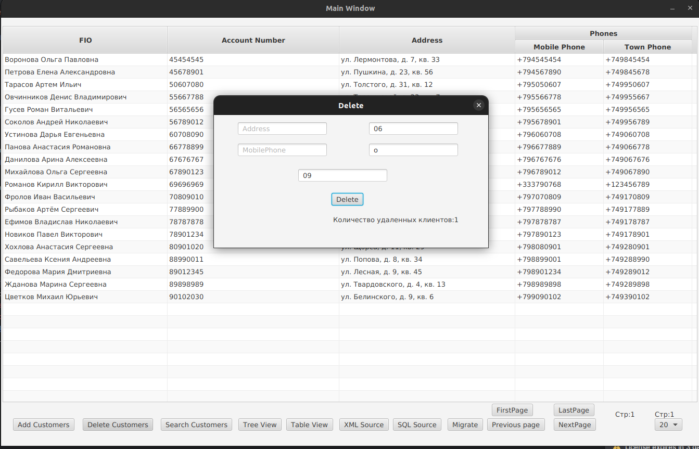

# Lab2

- Платформа: JavaFX

- Архитектура: MVC

- Источники данных: SQLite, xml с использованием DOM,SAX парсеров 

---

### Структура проекта

- `controllers/` — контроллеры для каждого окна и нитерфейс для реализации других котроллеров.
- `data/` — взаимодействие с источниками данных.
- `entities/` — необходимые сущности(Номер аккаунта,телефон и пр.).
- `ViewObjectsBuilder` — вспомогательные класс для создания шаблонных конструкций в View.
- `resources/view/` — визуальные окна приложения: главное окно, окно добавления, удаления, поиска.

---

### Возможности

#### Просмотр записей в постраничном виде

---

#### Просмотр записей в древовидном формте

---

#### Добавление записей в отдельном окне

---

#### Поиск записей в отдельном окне 

---

#### Удаление записей в отдельном окне

---

